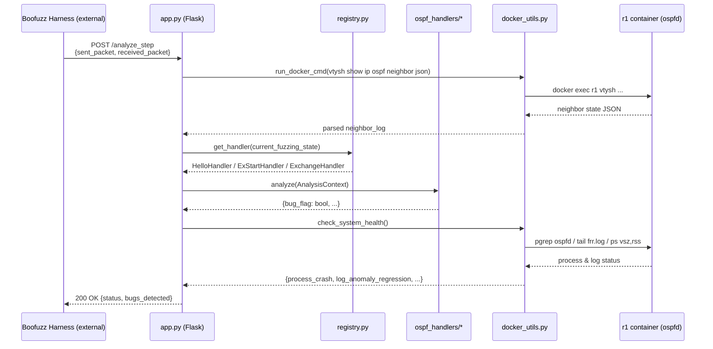

# OSPF State Monitor

**RFC 2328 Conformance Oracle for Boofuzz-Driven OSPF Fuzzing Campaigns**

[]()
[]()
[]()

---

## 1. Project Overview

`ospf-state-monitor` is the **stateful analysis engine** ("oracle") that pairs with an external Boofuzz-based OSPF fuzzing harness to detect RFC 2328 non-conformance in [FRRouting (FRR)](https://frrouting.org/)'s `ospfd` daemon.

The fuzzer harness is **not included in this repository**. This service is a target-side Flask application that:

- Receives a JSON pair of `(sent_packet, received_packet)` from the fuzzer via `POST /analyze_step` for every fuzzing iteration.
- Dispatches the pair to a **packet-type-specific handler** (Hello/2-Way, ExStart, Exchange) that evaluates the interaction against RFC 2328 state-transition rules.
- Cross-references FRR's own internal neighbor state (queried live via `vtysh show ip ospf neighbor json` inside the target container) to determine whether FRR's *actual* behavior matches the *expected* protocol behavior.
- Continuously monitors the target container's process health, log output, and memory footprint for crash and regression signatures.
- Exposes container lifecycle endpoints (`/health`, `/reset_ospf`) so the fuzzer can recover the target between malformed test cases.

**Functional scope:** OSPF adjacency formation only — Down → Init → 2-Way → ExStart → Exchange. Loading and Full state validation are **not implemented** in this handler set (see [Section 8](#8-troubleshooting)).

---

## 2. Prerequisites & Dependencies

### 2.1 Operating System

| Requirement | Version | Notes |
|---|---|---|
| OS | Linux (Ubuntu 20.04+ recommended) | `macvlan` networking and `privileged` containers require a native Linux Docker host — **not** Docker Desktop on macOS/Windows. |
| Kernel | Any with `macvlan` driver support | Standard on all modern distro kernels. |
| Physical/Virtual NIC | A parent interface for the macvlan network (e.g. `enp0s8`) | See [Section 5.2](#52-network-topology-macvlan). |

### 2.2 Software

| Software | Version | Installation Reference |
|---|---|---|
| Python | 3.8.x | [python.org/downloads](https://www.python.org/downloads/) — compiled `.pyc` artifacts in this repo confirm CPython 3.8 as the reference interpreter. |
| Docker Engine | 20.10+ | [docs.docker.com/engine/install](https://docs.docker.com/engine/install/) |
| Docker Compose | v2 (plugin, invoked as `docker compose`) | [docs.docker.com/compose/install](https://docs.docker.com/compose/install/) — **the legacy standalone `docker-compose` binary is not compatible**; the code invokes `['docker', 'compose', ...]` as two arguments. |
| vtysh / FRR image | `frrouting/frr:latest` (pulled automatically) | [github.com/FRRouting/frr](https://github.com/FRRouting/frr) |


## 3. Quick Start Guide

Estimated time to a running environment: **< 30 minutes**.

### 3.1 Clone and set up the Python environment

```bash
git clone <repository-url> ospf-state-monitor
cd ospf-state-monitor

python3.8 -m venv venv
source venv/bin/activate

```

### 3.2 Set the host-specific configuration

Open `config.py` and update `COMPOSE_FILE_PATH` to the **absolute path of your local clone**. This value is currently hardcoded to the original author's workstation path and **must** be changed or `docker compose` operations triggered from `/reset_ospf` will fail silently against the wrong directory:

```python
# config.py
COMPOSE_FILE_PATH = "/absolute/path/to/your/ospf-state-monitor/"
```

Confirm `INTERFACE_NAME` and `CONTAINER_NAME` match your intended target (defaults: `eth0` / `r1`).

### 3.3 Launch the OSPF target router (Docker)

The FRR router container **must** be started before the monitor application, and requires elevated privileges for `macvlan` network attachment and raw socket access inside the container:

```bash
sudo docker compose up -d
```

Verify the container and `ospfd` daemon are running:

```bash
sudo docker exec r1 vtysh -c "show ip ospf neighbor"
```

### 3.4 Run the monitor application

Only after the router container reports healthy, start the Flask service:

```bash
sudo python app.py
```

The service binds to `0.0.0.0:5000` by default. Confirm it is live:

```bash
curl http://localhost:5000/health
```

Expected response:

```json
{"status": "healthy"}
```

If this returns `503`, do not proceed — resolve per [Section 8](#8-troubleshooting) before pointing a fuzzing harness at the endpoint.

---

## 4. Project Architecture

### 4.1 Directory Structure

```mermaid
graph TD
    ROOT["ospf-state-monitor/"]
    ROOT --> APP["app.py<br/><i>Flask entrypoint & routes</i>"]
    ROOT --> BASE["base.py<br/><i>AnalysisContext, OspfPacketHandler ABC</i>"]
    ROOT --> REG["registry.py<br/><i>fuzzing-state → handler dispatch map</i>"]
    ROOT --> CFG["config.py<br/><i>environment constants</i>"]
    ROOT --> API["api/"]
    API --> SR["state_routes.py<br/><i>/valid_2way blueprint</i>"]
    ROOT --> CORE["core/"]
    CORE --> OS["ospf_state.py<br/><i>global_ospf_state singleton</i>"]
    CORE --> RC["runtime_check.py<br/><i>check_system_health()</i>"]
    CORE --> DU["docker_utils.py<br/><i>docker CLI wrapper</i>"]
    ROOT --> OH["ospf_handlers/"]
    OH --> H2W["hello_2way.py<br/><i>Hello / 2-Way validation</i>"]
    OH --> EXS["exstart.py<br/><i>ExStart validation</i>"]
    OH --> EXC["exchange.py<br/><i>Exchange validation</i>"]
    OH --> UT["utils.py<br/><i>clean_state()</i>"]
    ROOT --> R1["r1/"]
    R1 --> FRRCONF["frr.conf<br/><i>active router config</i>"]
    R1 --> DAEMONS["daemons<br/><i>enabled daemon list</i>"]
    ROOT --> DC["docker-compose.yml"]

    style ROOT fill:#1e293b,color:#fff
    style APP fill:#0f766e,color:#fff
    style REG fill:#0f766e,color:#fff
```



### 4.2 Component Interaction — `/analyze_step` Request Flow



### 4.3 Handler Dispatch Logic

`registry.py` maps the **fuzzing-state identifier** (`current_fuzzing_state`, supplied by the fuzzer — *not* the raw OSPF packet type) to a handler class:

| `current_fuzzing_state` | Handler | RFC 2328 Section |
|---|---|---|
| `2` | `hello_2wayHandler` | §10.5 — Hello Protocol / 2-Way state |
| `3` | `dbd_exstartHandler` | §10.6 — ExStart state, DBD negotiation |
| `4` | `dbd_exchangeHandler` | §10.6 — Exchange state, DBD sequencing |

Each handler consumes an `AnalysisContext` (`base.py`) bundling the fuzzer's sent packet, FRR's raw wire response, the mutable `global_ospf_state` singleton, and the live neighbor table, then returns a `Dict[str, bool]` of named bug signatures (e.g. `rfc_mtu_mismatch_accepted`, `rfc_invalid_control_bits_accepted`, `no_response_timeout`).

`global_ospf_state` (`core/ospf_state.py`) is a mutable, process-wide dataclass populated out-of-band by the fuzzer via `POST /valid_2way` — it represents the last *known-good* baseline (options, netmask, hello/dead intervals, MTU) that subsequent malformed-packet test cases are diffed against.

---

## 5. Configuration Management

### 5.1 `config.py` Reference

| Variable | Purpose | Action Required |
|---|---|---|
| `CONTAINER_NAME` | Docker container name targeted by all `docker exec`/`inspect` calls | Must match `container_name` in `docker-compose.yml` (default `r1`). |
| `INTERFACE_NAME` | Interface inside the container the fuzzer targets | Must match an interface defined in `r1/frr.conf`. |
| `LOG_FILE_PATH` | In-container path scanned for anomaly signatures | Must match the `log file` directive in `r1/frr.conf`. |
| `COMPOSE_FILE_PATH` | Working directory for `docker compose` subprocess calls issued from `/reset_ospf` | **Environment-specific — must be set per deployment.** No default is portable across machines. |

### 5.2 Network Topology (`macvlan`)

`docker-compose.yml` attaches the `r1` container to a `macvlan` network bound to a **parent host interface**:

```yaml
networks:
  fuzz_net:
    driver: macvlan
    driver_opts:
      parent: enp0s8   # <-- must exist on the host
    ipam:
      config:
        - subnet: 192.168.56.0/24
```

`enp0s8` is environment-specific (commonly a VirtualBox host-only adapter in the reference lab setup). Run `ip link show` on the deployment host and update `parent` accordingly. The static address `192.168.56.201` assigned to `eth0` inside `r1/frr.conf` must remain consistent with this subnet.

### 5.3 FRR Router Configuration

`r1/frr.conf` is the **active** configuration, bind-mounted read-write into `/etc/frr` inside the container. `r1/frr.conf.sav` is FRR's own auto-generated backup from a prior run with different addressing — it is not read at container start and should not be hand-edited to change behavior; treat it as historical artifact only.

---

## 6. Execution

### 6.1 Standard Fuzzing Campaign Procedure

1. Start the target: `sudo docker compose up -d`
2. Confirm health: `curl http://localhost:5000/health`
3. Launch the Boofuzz harness (external repository), pointed at this monitor's `http://<host>:5000/analyze_step` and `/valid_2way` endpoints.
4. Monitor `bugs_detected` in each response body; persist iterations that return non-empty bug dictionaries for offline triage.
5. After each test-case scenario is completed by the fuzzer, invoke `GET /reset_ospf` to restart the Docker-based OSPF router using a `docker compose down && docker compose up -d --force-recreate` cycle before proceeding to the next scenario.

### 6.2 Manual Recovery

```bash
curl http://localhost:5000/reset_ospf
```

Returns `{"reset": "ok"}` on success. This is a **blocking, synchronous** call (30s timeout per `docker compose` subprocess) — the fuzzer harness should pause packet transmission until this returns.

### 6.3 Endpoint Summary

| Endpoint | Method | Purpose |
|---|---|---|
| `/analyze_step` | `POST` | Primary conformance-check endpoint, invoked per fuzzing iteration. |
| `/valid_2way` | `POST` | Registers a known-good baseline into `global_ospf_state`. |
| `/health` | `GET` | Container + `ospfd` process liveness probe. |
| `/reset_ospf` | `GET` | Force-recreates the target container. |

---

## 7. Security Considerations

- **`debug=True` in `app.py`**: The Flask development server runs with the Werkzeug debugger enabled, which exposes a remote code execution surface via the interactive debugger console if any unhandled exception reaches an HTTP-facing traceback. Disable (`debug=False`) for any deployment reachable outside an isolated fuzzing lab network.
- **`privileged: true` container**: The `r1` service runs with full host privileges to support raw packet handling and `macvlan` attachment. Do not run this compose stack on a host that is not fully dedicated/isolated to fuzzing work.
- **Unauthenticated endpoints**: `/reset_ospf` and `/analyze_step` have no authentication or input-origin validation. Bind the Flask service to a loopback or lab-isolated interface only — never expose port `5000` to an untrusted network.
- **`subprocess` invocation surface**: All `docker` CLI calls in `core/docker_utils.py` use a fixed argument list (no shell interpolation of external input), which mitigates command injection — preserve this pattern in any future handler additions.

---

## 8. Troubleshooting

| Symptom | Likely Cause | Resolution |
|---|---|---|
| `docker compose up` fails with `unknown shorthand flag: 'f'` or similar | Legacy `docker-compose` v1 binary installed instead of the Compose v2 plugin | Install the Compose plugin per [Section 2.2](#22-software); invoke as `docker compose`, not `docker-compose`. |
| `/health` returns `503 container_not_running` | Router container not started, or `sudo docker compose up -d` was never run, or `CONTAINER_NAME` mismatch | Run `sudo docker ps` to confirm `r1` is `Up`; verify `config.py:CONTAINER_NAME` matches. |
| `/health` returns `503 ospfd_not_running` | `ospfd` daemon disabled or crashed inside container | Check `r1/daemons` has `ospfd=yes`; inspect `docker exec r1 tail -n 50 /var/log/frr/frr.log` for a crash trace. |
| `/reset_ospf` returns `{"reset": "failed"}` | `COMPOSE_FILE_PATH` in `config.py` does not point to a directory containing `docker-compose.yml` on this host | Update `COMPOSE_FILE_PATH` to the absolute path of your local clone (see [Section 3.2](#32-set-the-host-specific-configuration)). |
| `macvlan` network fails to create — `Error response from daemon: ... enp0s8` | Parent interface name does not exist on the deployment host | Run `ip link show`, update `parent:` in `docker-compose.yml` to match an existing host NIC. |
| Neighbor JSON always empty (`{}`) from `get_frr_internal_neighbors_json()` | `vtysh` command failing inside container, or no adjacency has formed yet | Manually run `docker exec r1 vtysh -c "show ip ospf neighbor json"`; confirm FRR version supports JSON output (8.x confirmed working per `r1/frr.conf`). |
| Fuzzer reports `unknown_packet_type_bypass` for every request | `current_fuzzing_state` sent by the harness does not match a key in `registry.py` (`2`, `3`, or `4`) | Confirm the fuzzer's state enum aligns with the registry; extend `_REGISTRY` for Loading/Full states if the harness has been updated to cover them (currently **not implemented**). |
| `Permission denied` on any `docker` subprocess call | Monitor process user lacks Docker daemon access, or compose commands were run without `sudo` | Run `sudo docker compose up -d` per [Section 3.3](#33-launch-the-ospf-target-router-docker); alternatively add the running user to the `docker` group and re-login. |


---

## 9. Contribution Guidelines

- **New protocol state coverage**: To add validation for Loading or Full states, implement a new `OspfPacketHandler` subclass in `ospf_handlers/`, register it in `registry.py` against its `current_fuzzing_state` key, and document the RFC 2328 section it enforces in a module-level docstring (see existing handlers for the expected format).
- **Bug flag naming convention**: Use the `rfc_<condition>_<accepted|rejected>` pattern for conformance violations (e.g. `rfc_mtu_mismatch_accepted`) and `<component>_<failure_mode>` for infrastructure faults (e.g. `process_crash`, `no_response_timeout`). Keep flags consistent with existing keys to avoid fragmenting downstream triage tooling.
- **Testing changes locally**: Use `curl` against `/valid_2way` and `/analyze_step` with hand-crafted JSON payloads (see the example payloads commented at the top of `exstart.py` and `exchange.py`) to validate handler logic before integrating with the live Boofuzz harness.
- **Do not commit** `__pycache__/`, environment-specific values in `config.py`, or `r1/frr.conf.sav`.

---
